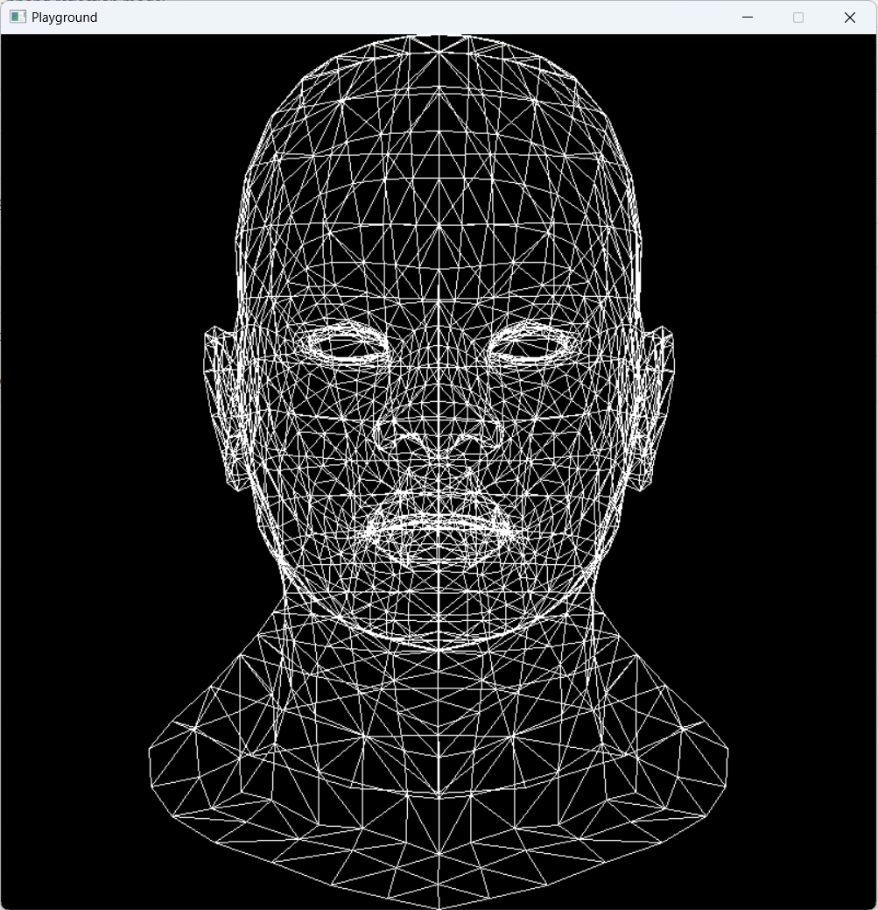
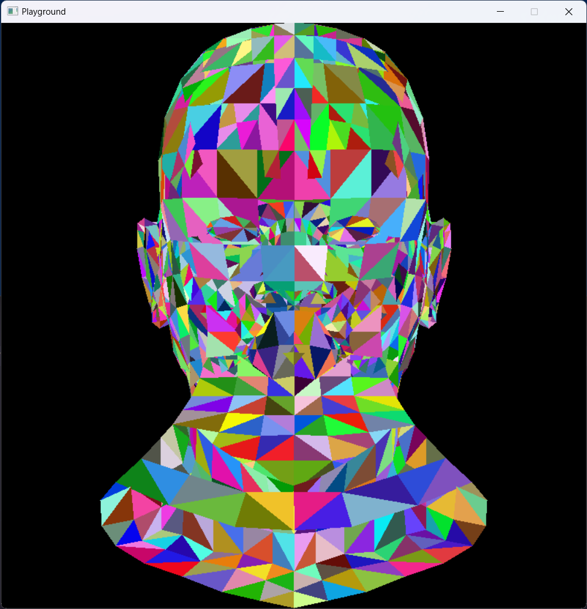
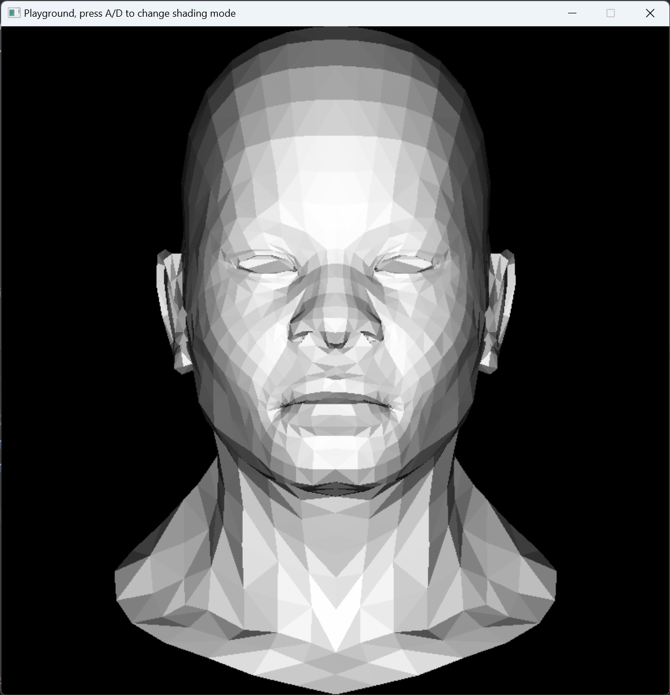

# Tiny Soft Renderer

A tiny software renderer implemented in Rust.

## Build

Install rust, then run examples in `examples` folder with `cargo r --example <example_name>`.

The first build may take some time as it statically compiles SDL2. The decision not to use `softbuffer` or `pixels`
crate stems from their requirement for the application to handle DPI scaling.

### Profiling

See [aclysma/profiling](https://github.com/aclysma/profiling)

```shell
# profile with tracy in release mode
cargo r --example obj_flat_shading -r --features=profile-with-tracy
```

## Examples

### Obj Model Flat Shading

<p align="left">
  
  
  
  
</p>

Press A => flat shading  
Press S => random color  
press D => wireframe  
no input => diffuse

```shell
cargo r --example obj_flat_shading
```

## References

- [ssloy/tinyrenderer](https://github.com/ssloy/tinyrenderer)
