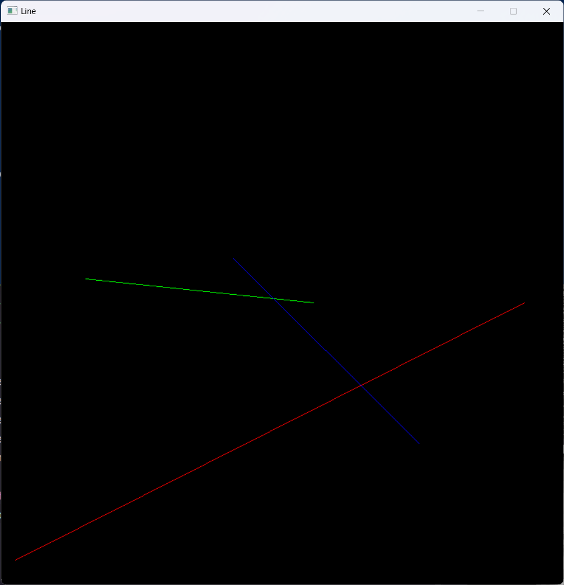
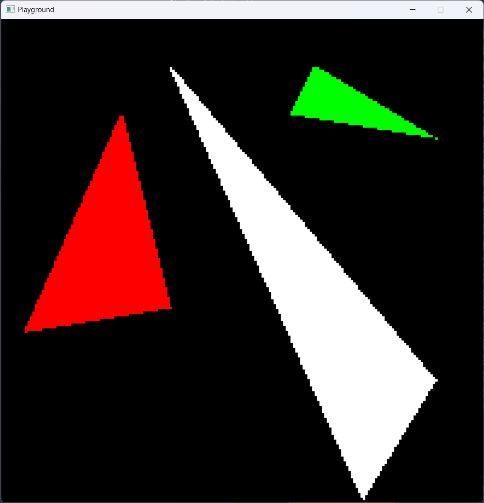
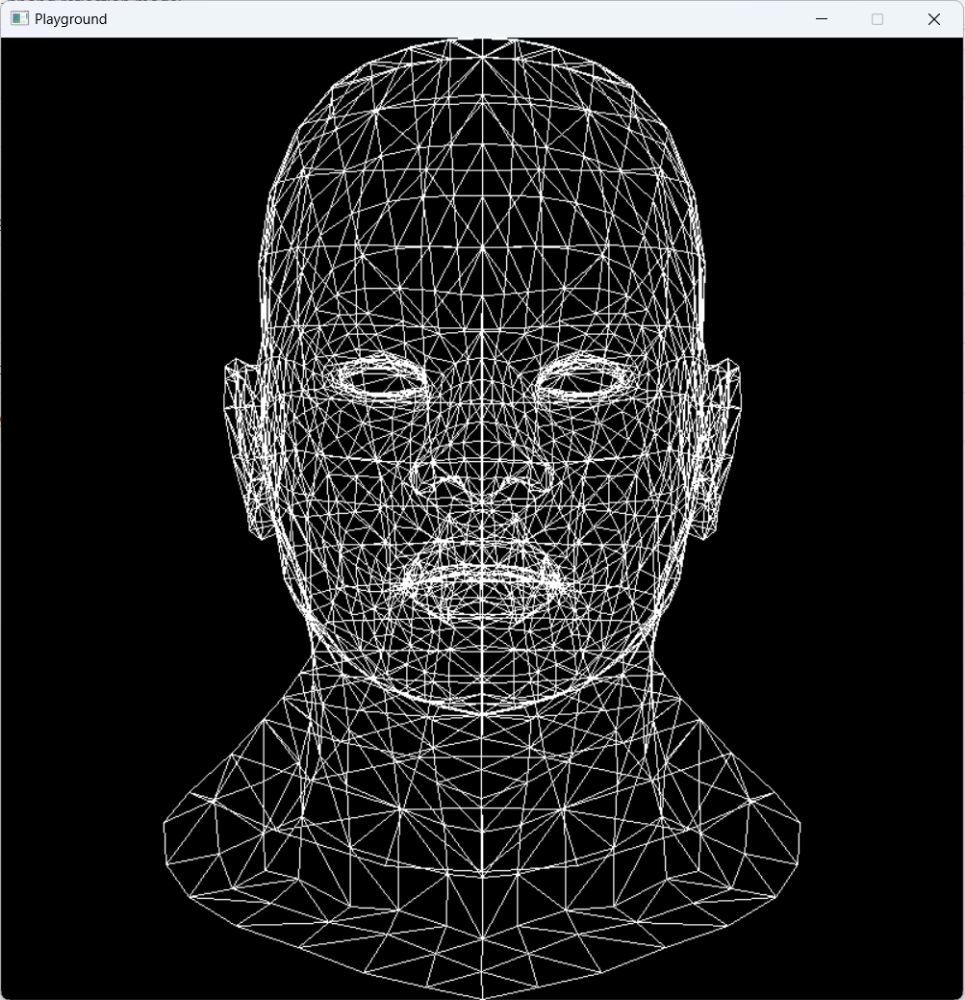
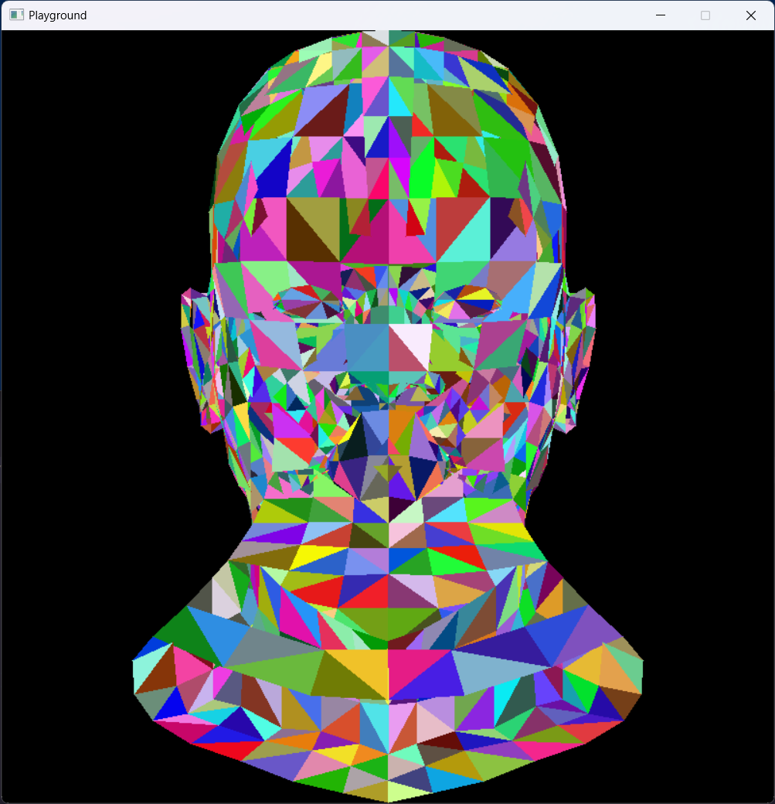
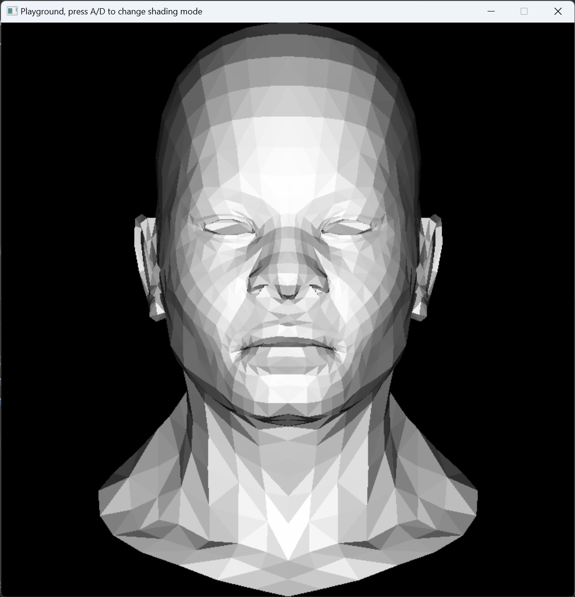
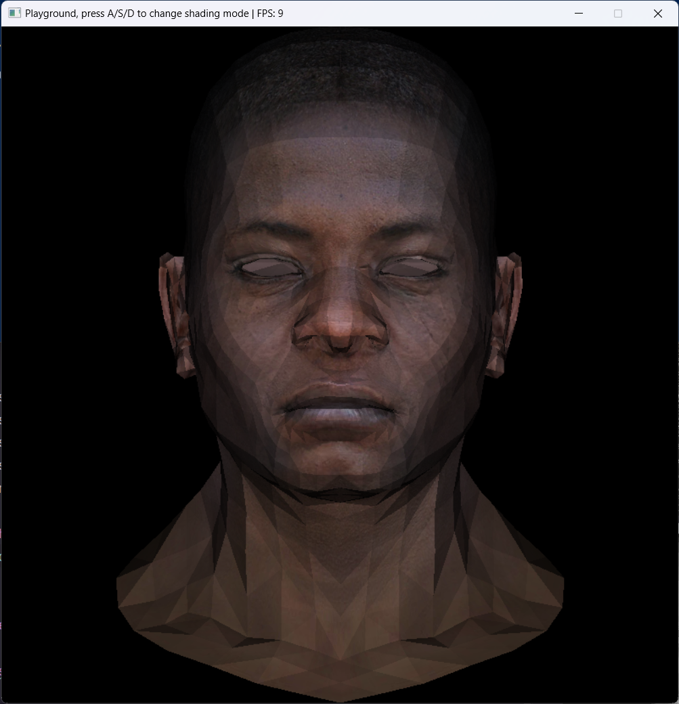
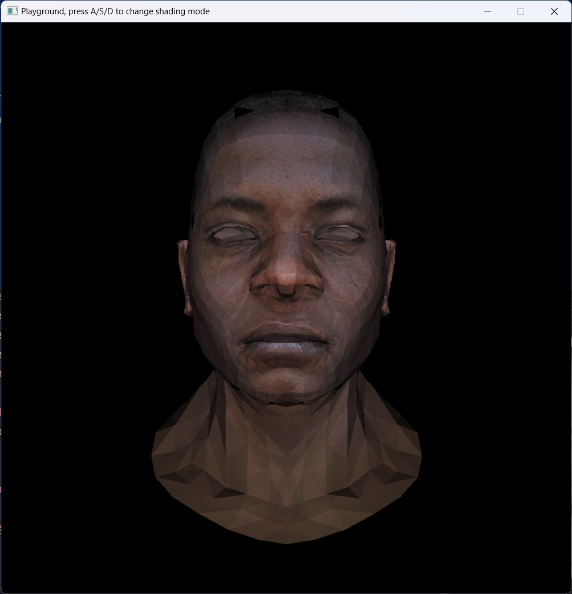

# Examples

## Line

<p align="left">
  
</p>

```shell
cargo r --example line
```

## Triangle

<p align="left">
  
</p>

```shell
cargo r --example triangle
```

## Obj Model Flat Shading

<p align="left">
  
  
  
  
  
</p>

Press A => flat shading  
Press S => random color  
Press D => wireframe  
Press W => diffuse  
No input => diffuse perspective

```shell
cargo r --example obj_flat_shading
```